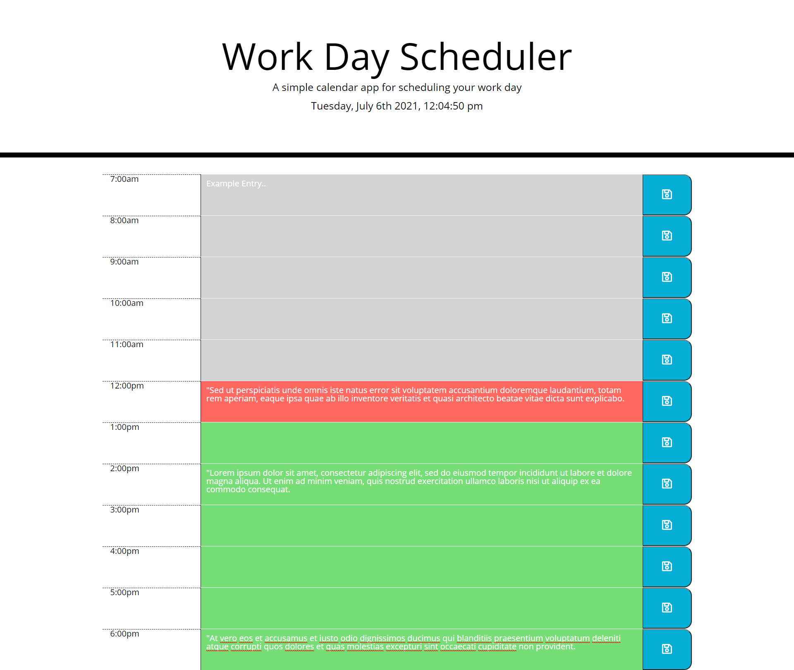

# Work Day Scheduler jQuery, Bootstrap, and Moment.js Demo
This is a work day scheduler calendar application that allows users to save events for each hour of the day. Entires into the scheduler are saved in local storage. The current hour is highlighted in red and future hours are green. This is dynamic based on the time of day. It utilizes jQuery and Moment.js along with bootstrap. 

It can be viewed live here: https://davidtunnell.github.io/work-day-scheduler-javascript-libraries-bootstrap/

## Screenshot

